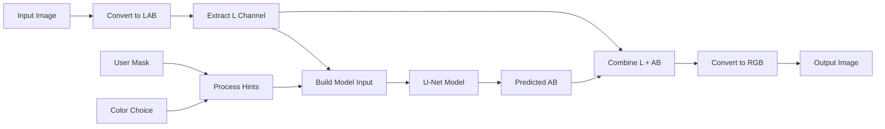

# 🎨 Conditional Image Colorization Project

A deep learning-powered image colorization system that automatically converts grayscale images to color, with the ability to guide colorization using conditional color hints. Built with PyTorch, U-Net architecture, and multiple user interfaces.


## 📋 Table of Contents

1. [Project Overview](#-project-overview)
2. [Key Features](#-key-features)
3. [Technology Stack](#-technology-stack)
4. [Quick Setup Guide](#-quick-setup-guide)
5. [Model Architecture](#-model-architecture)
6. [How It Works](#-how-it-works)
7. [Usage Interfaces](#-usage-interfaces)
8. [Experiments You Can Try](#-experiments-you-can-try)
9. [Project Structure](#-project-structure)
10. [Training Your Own Model](#-training-your-own-model)
11. [API Reference](#-api-reference)
12. [Troubleshooting](#-troubleshooting)
13. [Contributing](#-contributing)

## 🌟 Project Overview

This project implements a **conditional image colorization system** that can:

- **Automatically colorize** grayscale images using AI
- **Accept user hints** through masks and color specifications
- **Provide multiple interfaces** for different use cases (Jupyter notebooks, web app, REST API)
- **Train custom models** on your own datasets

The system uses a **U-Net architecture** trained in **LAB color space** for better perceptual results and supports both automatic and user-guided colorization workflows.

## ✨ Key Features

### 🤖 **AI-Powered Colorization**
- State-of-the-art U-Net deep learning model
- Trained in LAB color space for perceptually accurate results
- Automatic colorization without user input required

### 🎯 **Conditional Color Hints**
- Paint masks to specify which regions to colorize
- Choose custom colors for specific areas
- Combine automatic and manual colorization

### 🖥️ **Multiple Interfaces**
- **Jupyter Notebooks**: For experimentation and research
- **Gradio Web App**: User-friendly web interface
- **FastAPI REST API**: For integration with other applications
- **Command Line**: For batch processing

### 🚀 **Production Ready**
- Comprehensive error handling and logging
- Docker support for easy deployment
- Scalable architecture for high-throughput applications

## 🛠️ Technology Stack

- **Deep Learning**: PyTorch, torchvision
- **Computer Vision**: OpenCV, PIL, scikit-image
- **Web Framework**: FastAPI, Gradio
- **Data Processing**: NumPy, Pandas
- **Visualization**: Matplotlib, tqdm
- **Development**: Jupyter, Python 3.8+

## 🚀 Quick Setup Guide

### Prerequisites
- Python 3.8 or higher
- Git
- 4GB+ RAM (8GB+ recommended for training)
- GPU optional but recommended for training

### Step 1: Clone the Repository
```bash
git clone https://github.com/your-username/conditional-colorization-project.git
cd conditional-colorization-project
```

### Step 2: Create and Activate Virtual Environment
```bash
# Create virtual environment
python -m venv venv

# Activate virtual environment
# On Windows:
venv\Scripts\activate

# On macOS/Linux:
source venv/bin/activate
```

### Step 3: Install Dependencies
```bash
pip install -r requirements.txt
```

### Step 4: Prepare Your Dataset (Optional)
```bash
# Create data directories
mkdir -p data/train data/val

# Add your images to these directories
# Supported formats: .jpg, .jpeg, .png, .bmp, .webp
```

### Step 5: Launch Jupyter Notebook
```bash
# Start Jupyter
jupyter notebook

# Navigate to notebooks/ folder and open:
# - training.ipynb (to train a model)
# - inference.ipynb (to test colorization)
# - exploration.ipynb (to explore your data)
```

### Step 6: Alternative - Launch Web Interfaces
```bash
# Option A: Gradio Web App (User-friendly interface)
python app/gradio_app.py
# Opens at: http://localhost:7860

# Option B: FastAPI Server (For developers/integration)
python app/api_main.py
# Opens at: http://localhost:8000
# API docs: http://localhost:8000/docs
```

## 🧠 Model Architecture

### U-Net Deep Learning Architecture

Our colorization system uses a **U-Net architecture**, specifically designed for image-to-image translation tasks:

```
Input: 4 channels (L + hint_mask + hint_ab_colors)
         ↓
    Encoder (Downsampling)
    ├── Conv Block 1 (64 filters)
    ├── Conv Block 2 (128 filters)  
    ├── Conv Block 3 (256 filters)
    └── Conv Block 4 (512 filters)
         ↓
    Bottleneck (1024 filters)
         ↓
    Decoder (Upsampling + Skip Connections)
    ├── Up Block 1 + Skip → (512 filters)
    ├── Up Block 2 + Skip → (256 filters)
    ├── Up Block 3 + Skip → (128 filters)
    └── Up Block 4 + Skip → (64 filters)
         ↓
Output: 2 channels (A and B color channels)
```

### Why LAB Color Space?

- **L Channel**: Lightness (grayscale information)
- **A Channel**: Green-Red color axis
- **B Channel**: Blue-Yellow color axis

**Benefits:**
- More perceptually uniform than RGB
- Separates luminance from chrominance
- Better for colorization tasks
- Reduces artifacts and unrealistic colors

### Model Input Processing

1. **RGB Image** → Convert to LAB
2. **Extract L channel** (grayscale)
3. **Create hint mask** (where to apply colors)
4. **Generate hint colors** (what colors to apply)
5. **Concatenate** → [L, mask, hint_a, hint_b] = 4 channels
6. **Feed to U-Net** → Predicts A,B channels
7. **Combine L + predicted AB** → Convert back to RGB

## 🔄 How It Works

### Input Processing Pipeline



### Colorization Modes

#### 1. **Automatic Colorization**
```python
# No mask or color hints provided
colorizer.colorize(
    image_path="grayscale.jpg",
    output_path="colorized.png"
)
```
**What happens:**
- Model analyzes the grayscale image
- Automatically predicts appropriate colors
- Uses learned patterns from training data

#### 2. **Guided Colorization**
```python
# With mask and color hints
colorizer.colorize(
    image_path="grayscale.jpg",
    mask_path="mask.png",      # White areas = apply color
    color_hex="#ff6b6b",       # Red color for masked areas
    output_path="colorized.png"
)
```
**What happens:**
- Model respects your color choices in masked areas
- Automatically colorizes non-masked areas
- Blends guided and automatic colorization smoothly

#### 3. **Batch Processing**
```bash
# Process multiple images
for image in *.jpg; do
    python -m src.inference --img "$image" --output "colorized_$image"
done
```

## 🖥️ Usage Interfaces

### 1. **Jupyter Notebooks** (Recommended for Beginners)

#### `notebooks/training.ipynb`
**Purpose**: Train your own colorization model

**What you'll do:**
- Load and explore your dataset
- Configure training parameters
- Monitor training progress
- Visualize results and samples

**Expected workflow:**
```python
# 1. Check your data
data_status = check_dataset("data/train", "data/val")

# 2. Configure training
config = {
    'epochs': 50,
    'batch_size': 8,
    'learning_rate': 1e-4,
    'size': 256
}

# 3. Start training
trainer = Trainer(config)
trainer.train()

# 4. View results
show_training_samples()
```

#### `notebooks/inference.ipynb`
**Purpose**: Test colorization on your images

**What you'll do:**
- Load a trained model
- Test on sample images
- Experiment with color hints
- Compare different approaches

**Expected workflow:**
```python
# 1. Load model
colorizer = ColorizeInference("checkpoints/best_model.pth")

# 2. Basic colorization
result = colorizer.colorize("test_image.jpg", "result.png")

# 3. With color hints
result = colorizer.colorize(
    image_path="test_image.jpg",
    mask_path="my_mask.png",
    color_hex="#00aaff",
    output_path="blue_result.png"
)
```

#### `notebooks/exploration.ipynb`
**Purpose**: Explore and analyze your dataset

**What you'll do:**
- Visualize sample images
- Check image properties and statistics
- Validate data quality
- Understand your dataset characteristics

### 2. **Gradio Web App** (User-Friendly Interface)

**Launch**: `python app/gradio_app.py`
**URL**: http://localhost:7860

**Features:**
- **Drag-and-drop** image upload
- **Paint mask tool** for selecting regions
- **Color picker** for choosing hint colors
- **Real-time preview** of results
- **Download results** directly

**User Experience:**
1. Upload your grayscale or color image
2. Optionally paint a mask over areas you want to colorize
3. Choose a color from the color picker
4. Click "Colorize" button
5. View and download the result

**Perfect for:**
- Non-technical users
- Quick experiments
- Demonstrations
- Interactive exploration

### 3. **FastAPI REST API** (For Developers)

**Launch**: `python app/api_main.py`
**URL**: http://localhost:8000
**Docs**: http://localhost:8000/docs

**Endpoints:**
```bash
# Health check
GET /health

# Colorize image
POST /colorize
  - image: file upload
  - color_hex: hex color (optional)
  - mask: mask image (optional)

# Model information  
GET /model/info

# Reload model
POST /reload_model
```

**Example Usage:**
```python
import requests

# Upload and colorize
with open('image.jpg', 'rb') as f:
    response = requests.post(
        'http://localhost:8000/colorize',
        files={'image': f},
        data={'color_hex': '#ff6b6b'}
    )

# Save result
with open('result.png', 'wb') as f:
    f.write(response.content)
```

**Perfect for:**
- Integration with other applications
- Batch processing workflows
- Mobile app backends
- Web service integration

### 4. **Command Line Interface**

**Basic usage:**
```bash
# Simple colorization
python -m src.inference --img input.jpg --output result.png

# With color hints
python -m src.inference \
    --img input.jpg \
    --mask mask.png \
    --color "#ff6b6b" \
    --output result.png \
    --device cuda
```

**Training from command line:**
```bash
python -m src.train \
    --data data/train \
    --val data/val \
    --epochs 100 \
    --batch_size 16 \
    --learning_rate 1e-4
```

## 🧪 Experiments You Can Try

### 1. **Basic Colorization Experiments**

#### Experiment A: Automatic vs Manual
```python
# Compare automatic colorization with manual hints
results = []

# Automatic
auto_result = colorizer.colorize("test.jpg", "auto.png")

# Manual - different colors
for color in ["#ff0000", "#00ff00", "#0000ff"]:
    manual_result = colorizer.colorize(
        "test.jpg", f"manual_{color}.png", 
        mask_path="mask.png", color_hex=color
    )
    results.append(manual_result)

# Compare results visually
display_comparison(results)
```

#### Experiment B: Mask Size Impact
```python
# Test different mask sizes
mask_sizes = ["small_mask.png", "medium_mask.png", "large_mask.png"]

for mask in mask_sizes:
    result = colorizer.colorize(
        "test.jpg", f"result_{mask}", 
        mask_path=mask, color_hex="#ff6b6b"
    )
```

### 2. **Dataset Experiments**

#### Experiment C: Domain Adaptation
```python
# Train models on different image types
domains = {
    "portraits": "data/portraits/",
    "landscapes": "data/landscapes/", 
    "objects": "data/objects/"
}

for domain, path in domains.items():
    config['data_root'] = path
    trainer = Trainer(config)
    trainer.train()
    # Compare performance across domains
```

#### Experiment D: Training Data Size Impact
```python
# Test with different dataset sizes
data_sizes = [100, 500, 1000, 5000]

for size in data_sizes:
    # Create subset of data
    create_subset(f"data/subset_{size}/", size)
    
    # Train model
    config['data_root'] = f"data/subset_{size}/"
    trainer = Trainer(config)
    trainer.train()
    
    # Evaluate results
    evaluate_model(f"model_{size}.pth")
```

### 3. **Advanced Technical Experiments**

#### Experiment E: Architecture Variations
```python
# Test different model sizes
architectures = [
    {'base': 32, 'name': 'small'},
    {'base': 64, 'name': 'medium'},
    {'base': 128, 'name': 'large'}
]

for arch in architectures:
    config['base'] = arch['base']
    trainer = Trainer(config)
    trainer.train()
    # Compare speed vs quality
```

#### Experiment F: Loss Function Comparison
```python
# Compare different loss functions
loss_functions = [
    ColorL1Loss(),
    CombinedLoss(l1_weight=1.0, perceptual_weight=0.1),
    CombinedLoss(l1_weight=0.5, perceptual_weight=0.5)
]

for loss_fn in loss_functions:
    config['criterion'] = loss_fn
    trainer = Trainer(config)
    trainer.train()
```

### 4. **Creative Applications**

#### Experiment G: Style Transfer via Color
```python
# Extract colors from reference images
def extract_dominant_colors(image_path):
    # Implementation to get dominant colors
    return colors

ref_colors = extract_dominant_colors("reference_art.jpg")

# Apply these colors to target images
for color in ref_colors:
    stylized = colorizer.colorize(
        "target.jpg", f"styled_{color}.png",
        mask_path="full_mask.png", color_hex=color
    )
```

#### Experiment H: Temporal Consistency 
```python
# Process video frames with consistent colorization
import cv2

def colorize_video(input_video, output_video):
    cap = cv2.VideoCapture(input_video)
    frames = []
    
    while True:
        ret, frame = cap.read()
        if not ret:
            break
            
        # Convert frame to grayscale
        gray_frame = cv2.cvtColor(frame, cv2.COLOR_BGR2GRAY)
        
        # Colorize
        colorized = colorizer.colorize_frame(gray_frame)
        frames.append(colorized)
    
    # Save as video
    save_video(frames, output_video)
```

## 📁 Project Structure

```
conditional-colorization-project/
├── 📂 src/                          # Core source code
│   ├── __init__.py                  # Package initialization
│   ├── dataset.py                   # Data loading and preprocessing
│   ├── model.py                     # U-Net architecture implementation
│   ├── losses.py                    # Loss functions (L1, Perceptual, Combined)
│   ├── train.py                     # Training pipeline and utilities
│   ├── inference.py                 # Inference and colorization logic
│   └── utils.py                     # Utility functions (color space, metrics)
│
├── 📂 app/                          # Web applications
│   ├── gradio_app.py               # Interactive web interface
│   └── api_main.py                 # FastAPI REST API server
│
├── 📂 notebooks/                    # Jupyter notebooks
│   ├── training.ipynb              # Model training workflow
│   ├── inference.ipynb             # Testing and inference
│   └── exploration.ipynb           # Data exploration and analysis
│
├── 📂 data/                         # Dataset directories
│   ├── train/                      # Training images
│   └── val/                        # Validation images
│
├── 📂 checkpoints/                  # Saved model checkpoints
│   ├── best_model.pth              # Best performing model
│   ├── ckpt_epoch_1.pth           # Epoch checkpoints
│   └── ...
│
├── 📂 samples/                      # Training visualization samples
├── 📂 results/                      # Output results and experiments
├── 📂 frontend/                     # Optional frontend application
│   └── index.html                  # Simple HTML interface
│
├── 📄 requirements.txt              # Python dependencies
├── 📄 .gitignore                   # Git ignore rules
├── 📄 README.md                    # This file
└── 📄 LICENSE                      # Project license
```

## 🏋️ Training Your Own Model

### Step 1: Prepare Your Dataset

**Recommended dataset structure:**
```
data/
├── train/           # 1000+ images recommended
│   ├── image001.jpg
│   ├── image002.jpg
│   └── ...
└── val/             # 100+ images recommended  
    ├── val001.jpg
    ├── val002.jpg
    └── ...
```

**Dataset requirements:**
- **Format**: JPG, PNG, BMP, WebP
- **Size**: Any size (will be resized to 256x256)
- **Type**: Color images (grayscale will be generated automatically)
- **Quantity**: Minimum 100 images, recommended 1000+

### Step 2: Configure Training Parameters

```python
config = {
    # Data settings
    'data_root': 'data/train',
    'val_root': 'data/val',
    'size': 256,                    # Image resolution
    'max_hints': 20,                # Random hints during training
    
    # Model settings
    'base': 64,                     # Model complexity (32/64/128)
    
    # Training settings
    'epochs': 100,                  # Training duration
    'batch_size': 8,                # Adjust based on GPU memory
    'learning_rate': 1e-4,          # Learning rate
    'weight_decay': 1e-5,           # Regularization
    
    # Advanced settings
    'scheduler': 'plateau',         # Learning rate scheduling
    'early_stopping_patience': 15, # Stop if no improvement
    'grad_clip': 1.0,              # Gradient clipping
}
```

### Step 3: Monitor Training

**Key metrics to watch:**
- **Training Loss**: Should decrease steadily
- **Validation Loss**: Should decrease without overfitting
- **Sample Images**: Visual quality should improve
- **PSNR/SSIM**: Quantitative image quality metrics

**Training tips:**
- Start with smaller models (`base=32`) for quick experiments
- Use GPU if available (`device='cuda'`)
- Monitor for overfitting (val_loss increases while train_loss decreases)
- Adjust batch size based on available memory

### Step 4: Evaluate Results

```python
# Load trained model
colorizer = ColorizeInference('checkpoints/best_model.pth')

# Test on validation set
results = evaluate_on_dataset('data/val/', colorizer)

# Compute metrics
avg_psnr = np.mean([r['psnr'] for r in results])
avg_ssim = np.mean([r['ssim'] for r in results])

print(f"Average PSNR: {avg_psnr:.2f}")
print(f"Average SSIM: {avg_ssim:.3f}")
```
## Images Walkthrough

1. Epochos


2. 


3. Input, color gradient, and output


4. GUI
   


## 🔌 API Reference

### FastAPI Endpoints

#### `POST /colorize`
Colorize an uploaded image with optional color hints.

**Parameters:**
- `image` (file, required): Input image file
- `color_hex` (string, optional): Hex color code (e.g., "#ff6b6b")
- `mask` (file, optional): Mask image (white areas receive the color)

**Response:**
- Content-Type: `image/png`
- Body: Colorized image as PNG bytes

**Example:**
```bash
curl -X POST "http://localhost:8000/colorize" \
     -F "image=@input.jpg" \
     -F "color_hex=#ff6b6b" \
     -F "mask=@mask.png" \
     --output result.png
```

#### `GET /health`
Check API health and model status.

**Response:**
```json
{
    "status": "healthy",
    "model_loaded": true,
    "device": "cpu",
    "model_size": 256,
    "model_base": 64
}
```

#### `GET /model/info`
Get detailed model information.

**Response:**
```json
{
    "total_parameters": 7763362,
    "trainable_parameters": 7763362,
    "in_channels": 4,
    "out_channels": 2,
    "base_channels": 64,
    "device": "cpu",
    "input_size": 256
}
```

### Python API

```python
from src.inference import ColorizeInference

# Initialize colorizer
colorizer = ColorizeInference('path/to/model.pth', device='cpu')

# Basic colorization
result_path = colorizer.colorize(
    image_path='input.jpg',
    output_path='output.png'
)

# With color hints
result_path = colorizer.colorize(
    image_path='input.jpg',
    output_path='output.png',
    mask_path='mask.png',
    color_hex='#ff6b6b'
)
```

## 🔧 Troubleshooting

### Common Issues and Solutions

#### "No checkpoint found"
```
❌ Error: No checkpoint found. Please train the model first.
```
**Solution:**
1. Train a model first using `notebooks/training.ipynb`
2. Or download a pre-trained model
3. Ensure checkpoint files are in `checkpoints/` directory

#### "CUDA out of memory"
```
❌ Error: RuntimeError: CUDA out of memory
```
**Solutions:**
1. Reduce batch size: `config['batch_size'] = 2`
2. Use smaller model: `config['base'] = 32`  
3. Use CPU: `device = 'cpu'`
4. Clear GPU cache: `torch.cuda.empty_cache()`

#### "Import error: No module named 'src'"
```
❌ ImportError: No module named 'src'
```
**Solutions:**
1. Ensure you're in the project root directory
2. Add to Python path: `sys.path.append('.')`
3. Restart Jupyter kernel after changes

#### "Expected 3 channels, got (256, 256, 3)"
```
❌ ValueError: Expected 3 channels, got (256, 256, 3)
```
**Solution:**
This is a validation bug. Update `src/utils.py`:
```python
# Fix line in validate_image_array function:
if expected_channels is not None and img.shape[2] != expected_channels:
```

#### Poor colorization quality
**Possible causes and solutions:**
1. **Insufficient training data**: Add more diverse images
2. **Model too small**: Increase `base` parameter (32→64→128)
3. **Not enough training**: Increase `epochs`
4. **Learning rate issues**: Try different values (1e-5 to 1e-3)

### Performance Optimization

#### For Training:
- **GPU**: Use CUDA if available
- **Mixed Precision**: Add `torch.cuda.amp` for faster training
- **Data Loading**: Increase `num_workers` for faster data loading
- **Model Size**: Balance between quality and speed

#### For Inference:
- **Batch Processing**: Process multiple images together
- **Model Quantization**: Use `torch.jit` for faster inference
- **Input Size**: Smaller images process faster
- **Device**: GPU for large batches, CPU for single images

## 📊 Performance Metrics

### Training Performance
- **Small Model** (base=32): ~2M parameters, ~2 sec/batch (CPU)
- **Medium Model** (base=64): ~8M parameters, ~3 sec/batch (CPU)  
- **Large Model** (base=128): ~31M parameters, ~8 sec/batch (CPU)

### Inference Performance
- **CPU**: ~2-5 seconds per 256x256 image
- **GPU**: ~0.1-0.5 seconds per 256x256 image
- **Memory**: ~2-4GB RAM for inference

### Quality Metrics (on validation set)
- **PSNR**: 25-35 dB (higher is better)
- **SSIM**: 0.8-0.95 (closer to 1 is better)
- **Visual Quality**: Subjective evaluation recommended

## 🤝 Contributing

We welcome contributions! Here's how you can help:

### Types of Contributions
- **Bug fixes**: Report and fix issues
- **New features**: Add new colorization techniques
- **Documentation**: Improve guides and examples
- **Datasets**: Share interesting datasets for testing
- **Models**: Contribute pre-trained models

### Development Setup
```bash
# Fork the repository
git clone https://github.com/your-username/conditional-colorization-project.git

# Create development branch
git checkout -b feature/your-feature-name

# Install development dependencies
pip install -r requirements-dev.txt

# Make your changes
# Run tests
python -m pytest tests/

# Submit pull request
```

### Coding Standards
- Follow PEP 8 for Python code style
- Add docstrings to all functions
- Include type hints where possible
- Write unit tests for new features
- Update documentation for changes


## 🙏 Acknowledgments

- **U-Net Architecture**: Based on Ronneberger et al. "U-Net: Convolutional Networks for Biomedical Image Segmentation"
- **LAB Color Space**: For perceptually uniform colorization
- **PyTorch Team**: For the excellent deep learning framework
- **Gradio Team**: For the intuitive web interface framework
- **FastAPI Team**: For the high-performance API framework


**Happy Colorizing! 🎨**

---
